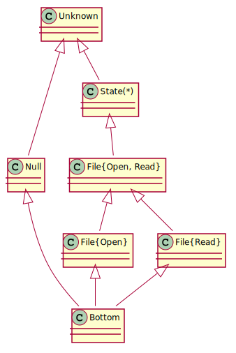

# Mungo plugin for Checker Framework

## How it works

### Type system

- `Unknown`: top type. Includes all possible values. `{...any}`
- `NullType`: set with only the null type. `{null}`
- `ObjectsWithStates`: all objects with protocols. Does NOT include null. `{...objects}`
- `Bottom`: bottom type. Used for computations that do not finish or error. Empty set. `{}`
    - Like `Nothing` in many languages or like `never` in TypeScript.

Note: `null` should NOT have the bottom type, otherwise its type would be the subtype of all types, allowing `null` assignments going unchecked. Which is what Java already (wrongly) does.

Subtypes of `ObjectsWithStates` are for example, the type of files that are in the `Open` or `Close` states, or the type of files that are only in the `Open` state.

The type of files that are only in the `Open` state is also a subtype of the type of files that are in the `Open` or `Close` states, since the set `{Open}` is contained in `{Open, Close}`.

The type of files that are in the `Open` state and the type of files that are in the `Close` state are not subtypes of each other, since one is not contained in the other and vice-versa.

<!-- http://www.plantuml.com/plantuml/uml/SoWkIImgAStDuGhDoyxBByzJiAdHrLNmAyt92QaiI4KLzK_AIaqkAGxFBCa8BaaiIItcmX21A5Hooyn9hVOlICtJKN3EoIzEhLNYmYA6hfYmAfXXCFT1v9poIqhoSxcG3KALGEX5at58pKi1UXu0 -->

#### Checking

- The type checker tracks all the possible states that an object might be in.
- When initializing, an object is only in its initial state.
- If a variable declaration is encountered, for example in a method argument, it is assumed that the object might be in any of its states. That can be refined with the use of `@MungoState({"Open"})`.
- When a method invocation is encountered, considering all possible states, the type checker creates a set with all the possible destination states via that method invocation. If that method invocation happened on the condition of a `if/while` statement or in the expression of a `switch` statement, the possible states are properly refined: if the transition leads to a decision state, only the destination state associated with the relevant label is added to the set of possible states.

### Architecture

- `MungoChecker`
    - The plugin's entry point
    - `MungoVisitor`
        - Performs assignment checking and method invocation checking.
        - `MungoAnnotatedTypeFactory`
            - Applies annotated types to AST nodes via `MungoDefaultQualifierForUseTypeAnnotator` and `MungoTreeAnnotator`
            - Also uses flow-sensitive information via `MungoAnalysis` and `MungoTransfer`
            - `MungoDefaultQualifierForUseTypeAnnotator`
                - Applies a set of annotations that should be applied to elements
            - `MungoTreeAnnotator`
                - Applies a set of annotations that should be applied to AST nodes
            - `MungoQualifierHierarchy`
                - Defines the subtyping relationship between annotations
            - `MungoAnalysis`
                - Tracks annotations using flow-sensitive analysis
                - `MungoTransfer`
                    - Propagates type information

#### To consider and fix

Type information in the Checker Framework is stored in annotations. In the current implementation, specific type information is stored in `MungoValue`'s used in `MungoAnalysis`. That is probably not correct because Checker uses annotated types to checks assignments, not `MungoValue`'s. Unfortunately, working with annotations is not natural, since they are only able to store some types of values, not arbitrary objects, so extracting the necessary type information from annotations adds unnecessary burden. To consider:

- Store everything in annotated types
    - Pros: More in line with Checker's "spirit". Checker does assignment checks for us.
    - Cons: Burden in extracting type information.
- Keep information in `MungoValue`'s and implement our assignment checks
    - Pros: More natural?
    - Cons: How to get the inferred `MungoValue`'s for method arguments when encountering a method invocation in `MungoVisitor`?
- Do not use the whole Checker Framework. Just reuse the flow analysis part.
    - Pros: Ignores completely the whole idea of annotated types and reduces unnecessary work. Removing the "magic" that happens behind and implementing it ourselves might also help in the task of formalizing what is actually happening.
    - Cons: More work? Maybe not. Needs investigation.

## Building

- Unix: `./gradlew build`
- Windows: `gradlew.bat build`

## Remote testing

- Unix: `./gradlew test --debug-jvm`
- Windows: `gradlew.bat test --debug-jvm`

## TODO's

- Create more tests
- Document tests (latex)
  - Code and output

### Important things to test/fix

- Check assignments (variable declarations and method arguments - e.g. `@MungoState({}) Iterator it = etc;`)
- Only allow null assignments if object is in the end state or is already null
- Objects with no protocol are getting the unknown type, disallowing any use of them
    - Solution: Create a type for objects with no protocols instead of attributing to them the `Unknown` type.
- Should "end" be in the list of concrete states? If not, depends on:
  - Control that if an object reaches the "end" state, it is dropped
- Force an object to reach the "end" state if dropped
- Deal with the values of fields inside objects
  - Combating against defensive programming
- Validate protocols
  - Check if there are duplicate transitions, if types exist, etc...
- Review other todo's in the code...

## Proposals from thesis plan

- [x] Replacing the mungo.lib.Boolean enumeration with the standard boolean
- [x] Improving of flow analysis around loops and switch statements
  - Out of the box with Checker
- [ ] Recognition of decisions made with if statements
- [ ] Ability to associate protocol definitions with already present classes or interfaces
- [ ] Adding support for droppable objects
- [ ] Generics
- [ ] Collections support
  - Done in part: if a method is available in all states, its call is allowed.
  - This allows one to check the current state of an object.
- [ ] Adding support for state transitions depending on method arguments

### Other features

- [x] @MungoState({"HasNext"})
- [ ] Support state change depending on exceptions
- [ ] Inheritance? Protocols in interfaces?
  - What if a class has a protocol, and implements an interface with a protocol as well?
  - Test if a protocol is a subtype of other protocol? How so?
